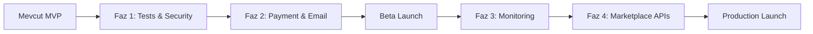

# 🎯 YAVER (SellerAI) - Kapsamlı Proje Değerlendirmesi

**Değerlendirme Tarihi:** 31 Aralık 2024  
**Değerlendiren:** Senior Product Manager Perspektifi  
**Proje Durumu:** MVP / Early Stage

---

## 📊 Yönetici Özeti

YAVER, e-ticaret satıcıları için AI destekli içerik optimizasyonu platformu olarak güçlü bir temel üzerine kurulmuş. Modern teknoloji stack'i (Bun + Hono + Next.js 16) ve iyi yapılandırılmış modüler mimari ile ölçeklenebilir bir yapıya sahip. Ancak **production-ready** olmak için kritik eksiklikler bulunuyor.

### 🟢 Güçlü Yönler
- Modern, performanst stack (Bun runtime)
- İyi organize edilmiş modüler backend mimarisi
- Kapsamlı veritabanı şeması
- Multi-marketplace desteği (Trendyol, Hepsiburada, Amazon)
- AI entegrasyonları (OpenAI + Fal.ai)

### 🔴 Kritik Eksiklikler
- Test coverage yok (%0)
- Monitoring & Logging eksik
- Production deployment hazırlıkları eksik
- Payment gateway entegrasyonu yok
- Rate limiting yok

---

## 🏗️ Mevcut Mimari Analizi

### Backend Stack
| Teknoloji | Versiyon | Değerlendirme |
|-----------|----------|---------------|
| Runtime | Bun | ✅ Modern, performanslı |
| Framework | Hono 4.10 | ✅ Hafif, hızlı |
| Database | PostgreSQL + Drizzle | ✅ Type-safe, iyi tercih |
| Auth | JWT (Access + Refresh) | ⚠️ Temel düzeyde |
| AI | OpenAI + Fal.ai | ✅ İyi entegrasyon |
| Validation | Zod | ✅ Type-safe |

### Frontend Stack
| Teknoloji | Versiyon | Değerlendirme |
|-----------|----------|---------------|
| Framework | Next.js 16 | ⚠️ Experimental (RC) |
| React | 19.2.1 | ⚠️ Çok yeni |
| Styling | Tailwind CSS 4 | ⚠️ Beta |
| Animations | Framer Motion | ✅ İyi |
| 3D | Three.js + drei | ✅ Landing için güzel |

> [!WARNING]
> **Frontend Stack Riski:** Next.js 16, React 19, ve Tailwind CSS 4 henüz stabil değil. Production'a çıkmadan önce breaking changes yaşanabilir.

### Modül Yapısı
```
src/modules/
├── admin/        # Admin dashboard
├── ai/           # AI içerik üretimi
├── auth/         # Kimlik doğrulama
├── categories/   # Kategori yönetimi
├── credits/      # Kredi sistemi
├── errors/       # Hata yönetimi
├── marketplace/  # Pazaryeri entegrasyonu
├── products/     # Ürün yönetimi
├── queue/        # İşlem kuyruğu
├── sse/          # Server-Sent Events
├── subscriptions/# Abonelik sistemi
└── upload/       # Dosya yükleme
```

---

## 🔴 KRİTİK EKSİKLİKLER

### 1. Test Coverage - **ACIL**

| Kategori | Durum | Öncelik |
|----------|-------|---------|
| Unit Tests | ❌ Yok | 🔴 Kritik |
| Integration Tests | ❌ Yok | 🔴 Kritik |
| E2E Tests | ❌ Yok | 🟡 Yüksek |
| Load Tests | ❌ Yok | 🟡 Yüksek |

**Önerilen Teknolojiler:**
- Backend: `bun:test` (mevcut script var ama test yok)
- Frontend: `@testing-library/react` + `jest` veya `vitest`
- E2E: `Playwright` veya `Cypress`
- Load: `k6` veya `artillery`

```typescript
// Örnek test yapısı önerisi
src/
├── modules/
│   ├── auth/
│   │   ├── auth.service.ts
│   │   ├── auth.service.test.ts     // ← EKLENMELİ
│   │   ├── auth.routes.ts
│   │   └── auth.routes.test.ts      // ← EKLENMELİ
```

---

### 2. Monitoring & Observability

| Eksik Alan | Önerilen Çözüm |
|------------|----------------|
| Application Performance | `DataDog`, `New Relic`, veya `Sentry` |
| Logging | `Pino` + `Elasticsearch` veya `Loki` |
| Metrics | `Prometheus` + `Grafana` |
| Error Tracking | `Sentry` |
| Uptime Monitoring | `BetterStack`, `Uptime Robot` |

**Eklenmesi Gereken:**
```typescript
// src/core/logging/logger.ts
import pino from 'pino';

export const logger = pino({
  level: process.env.LOG_LEVEL || 'info',
  transport: {
    target: 'pino-pretty', // dev only
  },
});
```

---

### 3. Security Hardening

| Risk | Mevcut Durum | Çözüm |
|------|--------------|-------|
| Rate Limiting | ❌ Yok | `@hono/rate-limiter` veya custom Redis-based |
| CORS | ⚠️ Basit | Production'da whitelist yapılmalı |
| Helmet/Security Headers | ❌ Yok | `@hono/secure-headers` |
| Input Sanitization | ⚠️ Zod ile kısmi | XSS için ek kontrol |
| SQL Injection | ✅ Drizzle ORM | OK |
| CSRF Protection | ❌ Yok | Token-based CSRF |
| API Key Rotation | ❌ Yok | Key management sistemi |

**Rate Limiting Örneği:**
```typescript
import { rateLimiter } from 'hono-rate-limiter';

app.use('*', rateLimiter({
  windowMs: 15 * 60 * 1000, // 15 dakika
  limit: 100, // IP başına
  keyGenerator: (c) => c.req.header('x-forwarded-for') || 'unknown',
}));
```

---

### 4. Payment Gateway Entegrasyonu - **REVENUE CRITICAL**

Kredi sistemi veritabanında var ama gerçek ödeme entegrasyonu yok!

**Önerilen Gateway'ler (Türkiye için):**
| Gateway | Avantaj | Dezavantaj |
|---------|---------|------------|
| iyzico | Kolay entegrasyon, TL desteği | Komisyon yüksek |
| PayTR | Düşük komisyon | SDK eski |
| Stripe | Global, güçlü API | TL ayarları karmaşık |
| Param | Yerel | Dokümantasyon zayıf |

**Gerekli Tablolar (Mevcut değil):**
```sql
-- payment_intents
CREATE TABLE payment_intents (
  id SERIAL PRIMARY KEY,
  user_id INT REFERENCES users(id),
  amount DECIMAL(10,2) NOT NULL,
  currency VARCHAR(3) DEFAULT 'TRY',
  gateway VARCHAR(50) NOT NULL,
  gateway_payment_id VARCHAR(255),
  status VARCHAR(20), -- pending, succeeded, failed
  created_at TIMESTAMP DEFAULT NOW()
);
```

---

### 5. Email Service

| Özellik | Durum | Öneri |
|---------|-------|-------|
| Transactional Email | ❌ Yok | Resend, SendGrid, veya Mailgun |
| Email Templates | ❌ Yok | React Email veya MJML |
| Queue | ❌ Yok | BullMQ + Redis |

**Gerekli Email'ler:**
- ✉️ Welcome email
- ✉️ Password reset (tablo var ama email yok!)
- ✉️ Payment confirmation
- ✉️ Low credit warning
- ✉️ Generation complete notification

---

### 6. Background Jobs & Queue System

Mevcut `queue` modülü basit. Gerçek production için:

| Özellik | Mevcut | Önerilen |
|---------|--------|----------|
| Job Queue | ⚠️ Database-based | Redis + BullMQ |
| Retry Logic | ⚠️ Basit | Exponential backoff |
| Dead Letter Queue | ❌ Yok | ✅ Eklenmeli |
| Job Scheduling | ❌ Yok | Cron jobs |
| Dashboard | ❌ Yok | Bull Board |

```typescript
// Önerilen yapı
import { Queue, Worker } from 'bullmq';

const imageQueue = new Queue('image-processing', { connection: redis });

const worker = new Worker('image-processing', async (job) => {
  // AI görsel işleme
}, {
  connection: redis,
  concurrency: 5,
  limiter: { max: 10, duration: 1000 },
});
```

---

## 🟡 ÖNEMLİ EKSİKLİKLER

### 7. Caching Layer

| Alan | Öneri |
|------|-------|
| API Response Cache | Redis + `@hono/cache` |
| Database Query Cache | Drizzle + Redis |
| Static Assets | CDN (Cloudflare, Bunny CDN) |
| Session Store | Redis |

### 8. File Storage & CDN

Mevcut: Local `/uploads/` folder ❌

**Production için:**
| Servis | Kullanım |
|--------|----------|
| AWS S3 / Cloudflare R2 | Object storage |
| CloudFlare CDN / Bunny CDN | Global delivery |
| Image Optimization | Cloudflare Images veya imgproxy |

### 9. Real Marketplace API Entegrasyonları

Marketplace config var ama gerçek API entegrasyonu yok:

| Marketplace | Durum | Önem |
|-------------|-------|------|
| Trendyol Seller API | ❌ Yok | 🔴 Kritik |
| Hepsiburada Merchant API | ❌ Yok | 🔴 Kritik |
| Amazon SP-API | ❌ Yok | 🟡 Orta |
| n11 API | ❌ Yok | 🟢 Düşük |

### 10. Analytics & Business Intelligence

| Eksik | Öneri |
|-------|-------|
| User Analytics | PostHog, Mixpanel, veya Amplitude |
| Business Metrics | Metabase veya custom dashboard |
| AI Usage Analytics | Custom logging |
| Conversion Tracking | Segment |

---

## 🟢 İYİLEŞTİRME ÖNERİLERİ

### 11. Developer Experience

| Alan | Mevcut | Öneri |
|------|--------|-------|
| API Documentation | ✅ Swagger UI | Daha detaylı örnekler |
| Local Dev | ⚠️ Manuel | Docker Compose full stack |
| Environment | ⚠️ .env | dotenv-vault veya infisical |
| Code Generation | ❌ Yok | Hono client generation |

### 12. DevOps & Infrastructure

```yaml
# Önerilen docker-compose.yml genişletmesi
services:
  postgres:
    # mevcut...
  
  redis:
    image: redis:7-alpine
    ports: ["6379:6379"]
  
  backend:
    build: .
    environment:
      - DATABASE_URL=...
    depends_on:
      - postgres
      - redis
  
  frontend:
    build: ./frontend
    depends_on:
      - backend
```

### 13. CI/CD Pipeline İyileştirmeleri

Mevcut CI temel düzeyde. Eklenmeli:

```yaml
# .github/workflows/ci.yml - genişletilmiş
jobs:
  # ... mevcut jobs
  
  security:
    - name: Security Scan
      run: bun audit
    - name: SAST
      uses: github/codeql-action/analyze@v2
  
  deploy:
    needs: [backend, frontend, security]
    if: github.ref == 'refs/heads/main'
    # Deployment steps
```

---

## 📋 ÖNCELİKLENDİRİLMİŞ ROADMAP

### Faz 1: Foundation (2-3 Hafta) 🔴
1. [ ] Unit test altyapısı kurulumu
2. [ ] Critical path testleri (auth, credits, products)
3. [ ] Logging sistemi (Pino)
4. [ ] Rate limiting
5. [ ] Security headers

### Faz 2: Payment & Core (3-4 Hafta) 🔴
1. [ ] Payment gateway entegrasyonu (iyzico)
2. [ ] Email servisi (Resend)
3. [ ] Redis + BullMQ queue sistemi
4. [ ] S3/R2 file storage migration

### Faz 3: Observability (2 Hafta) 🟡
1. [ ] Sentry error tracking
2. [ ] Prometheus metrics
3. [ ] Grafana dashboards
4. [ ] Health check endpoints

### Faz 4: Marketplace APIs (4-6 Hafta) 🟡
1. [ ] Trendyol Seller API entegrasyonu
2. [ ] Hepsiburada Merchant API entegrasyonu
3. [ ] One-click publish özelliği
4. [ ] Inventory sync

### Faz 5: Scale & Optimize (Ongoing) 🟢
1. [ ] E2E test suite
2. [ ] Load testing
3. [ ] Caching layer
4. [ ] CDN entegrasyonu
5. [ ] Analytics

---

## 💰 TAHMINI KAYNAK GEREKSİNİMİ

### Teknoloji Maliyetleri (Aylık)
| Servis | Tahmin | Not |
|--------|--------|-----|
| PostgreSQL (Managed) | $25-50 | Supabase, Neon |
| Redis (Managed) | $15-30 | Upstash |
| S3/R2 Storage | $5-20 | İlk 10GB ücretsiz |
| Sentry | $26+ | Team plan |
| Email (Resend) | $0-20 | 3K/ay ücretsiz |
| CDN | $5-20 | Bunny CDN ucuz |
| **Toplam** | **~$100-200/ay** | MVP için |

### İnsan Kaynağı
| Rol | Süre | Önem |
|-----|------|------|
| Senior Backend Dev | 2-3 ay | Payment, Queue, Tests |
| DevOps Engineer | 1 ay | Infrastructure |
| QA Engineer | Ongoing | Test coverage |

---

## 🎯 SONUÇ

YAVER projesi **güçlü bir MVP temeline** sahip ancak **production-ready değil**. Özellikle:

1. **Test coverage** olmadan güvenli deployment yapılamaz
2. **Payment gateway** olmadan monetization başlamaz
3. **Marketplace API'leri** olmadan gerçek değer sağlanamaz

### Tavsiye Edilen Yaklaşım



> [!IMPORTANT]
> **Beta launch için minimum gereksinimler:**
> - ✅ Unit & Integration tests (%60+ coverage)
> - ✅ Payment gateway çalışır durumda
> - ✅ Email servisi aktif
> - ✅ Error tracking (Sentry)
> - ✅ Rate limiting

---

## 📚 EK KAYNAKLAR

### Önerilen Kütüphaneler
```json
{
  "dependencies": {
    "pino": "^8.x",           // Logging
    "bullmq": "^5.x",         // Job queue
    "resend": "^2.x",         // Email
    "ioredis": "^5.x",        // Redis client
    "@sentry/node": "^7.x",   // Error tracking
    "@aws-sdk/client-s3": "^3.x" // S3 storage
  }
}
```

### Faydalı Linkler
- [Hono Best Practices](https://hono.dev/guides/best-practices)
- [Drizzle ORM Docs](https://orm.drizzle.team/)
- [iyzico API Docs](https://dev.iyzipay.com/)
- [Trendyol Seller API](https://developers.trendyol.com/)

---

*Bu değerlendirme, projenin mevcut durumunu ve production-ready hale gelmesi için gereken adımları özetlemektedir. Sorularınız için tartışabiliriz.*
