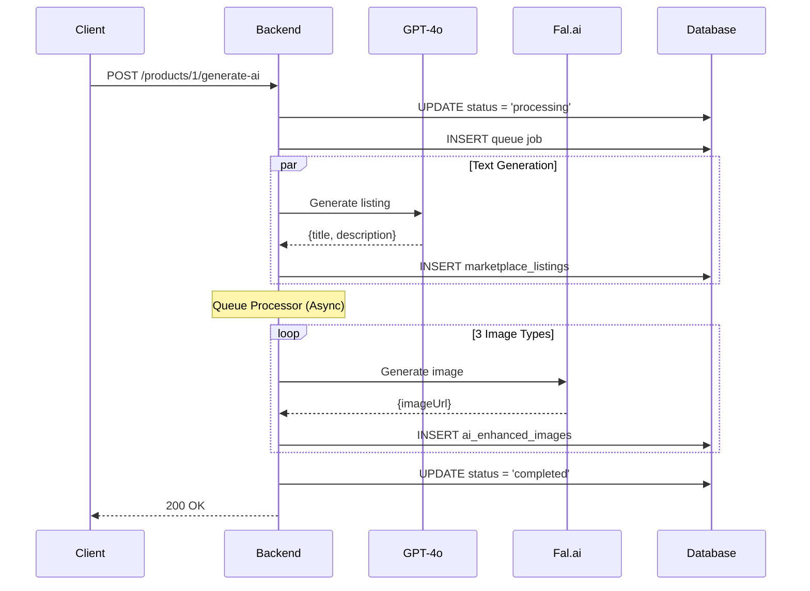
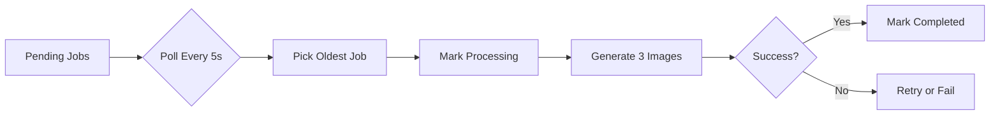

# 🖥️ YAVER - Backend Mimarisi

Bu döküman, YAVER platformunun backend yapısını, API'lerini ve servislerini açıklar.

---

## 📊 Genel Bakış

| Özellik | Değer |
|---------|-------|
| **Runtime** | Bun v1.3+ |
| **Framework** | ElysiaJS |
| **ORM** | Drizzle ORM |
| **Veritabanı** | PostgreSQL |
| **Dil** | TypeScript |
| **Port** | 8881 |

---

## 📁 Klasör Yapısı

```
src/
├── core/                    # Çekirdek altyapı
│   ├── database/
│   │   ├── index.ts         # DB bağlantısı
│   │   ├── schema.ts        # Tablo tanımları
│   │   └── seeds/           # Seed verileri
│   ├── middleware/
│   │   └── auth.ts          # JWT doğrulama
│   └── utils/
│       ├── errors.ts        # Özel hata sınıfları
│       └── logger.ts        # Loglama
│
├── modules/                 # İş mantığı modülleri
│   ├── auth/                # Kimlik doğrulama
│   ├── products/            # Ürün yönetimi
│   ├── ai/                  # AI servisleri
│   ├── queue/               # Kuyruk işleme
│   ├── credits/             # Kredi sistemi
│   ├── subscriptions/       # Abonelik yönetimi
│   ├── marketplace/         # Pazaryeri
│   ├── categories/          # Kategoriler
│   ├── upload/              # Dosya yükleme
│   ├── admin/               # Admin paneli
│   └── errors/              # Hata yönetimi
│
├── index.ts                 # Uygulama giriş noktası
└── app.ts                   # Elysia app konfigürasyonu
```

---

## 🔌 API Endpoints

### 🔐 Auth Modülü (`/auth`)

| Method | Endpoint | Açıklama | Auth |
|--------|----------|----------|------|
| POST | `/auth/register` | Yeni kullanıcı kaydı | ❌ |
| POST | `/auth/login` | Giriş yap | ❌ |
| POST | `/auth/google` | Google OAuth | ❌ |
| POST | `/auth/refresh` | Token yenile | ❌ |
| GET | `/auth/me` | Profil bilgisi | ✅ |
| POST | `/auth/forgot-password` | Şifre sıfırlama e-postası | ❌ |
| POST | `/auth/reset-password` | Şifre sıfırla | ❌ |

**Örnek Response (Login):**
```json
{
  "success": true,
  "data": {
    "accessToken": "eyJhbG...",
    "refreshToken": "eyJhbG...",
    "user": {
      "id": 1,
      "email": "user@example.com",
      "firstName": "Ali"
    }
  }
}
```

---

### 📦 Products Modülü (`/products`)

| Method | Endpoint | Açıklama | Auth |
|--------|----------|----------|------|
| GET | `/products` | Ürün listesi (paginated) | ✅ |
| GET | `/products/:id` | Tek ürün detayı | ✅ |
| POST | `/products` | Yeni ürün oluştur | ✅ |
| PATCH | `/products/:id` | Ürün güncelle | ✅ |
| DELETE | `/products/:id` | Ürün sil | ✅ |
| GET | `/products/:id/listings` | Ürün listeleri | ✅ |
| POST | `/products/:id/generate-ai` | AI içerik üret | ✅ |

**POST /products/:id/generate-ai Akışı:**


---

### 💰 Credits Modülü (`/credits`)

| Method | Endpoint | Açıklama | Auth |
|--------|----------|----------|------|
| GET | `/credits` | Kredi bakiyesi | ✅ |
| GET | `/credits/history` | Kredi geçmişi | ✅ |
| POST | `/credits/purchase` | Kredi satın al | ✅ |

**Kredi Sistemi:**
- `subscriptionCredits`: Aylık yenilenen, silinebilir
- `extraCredits`: Satın alınan, birikimli
- Harcama sırası: Önce subscription, sonra extra

---

### 📋 Subscriptions Modülü (`/subscriptions`)

| Method | Endpoint | Açıklama | Auth |
|--------|----------|----------|------|
| POST | `/subscriptions/upgrade` | Plan yükselt | ✅ |

**Planlar:**
| Plan | Fiyat | Aylık Kredi |
|------|-------|-------------|
| Starter | 0₺ | 10 |
| Pro | 299₺ | 100 |
| Enterprise | 999₺ | 500 |

---

### 🏪 Marketplace Modülü (`/marketplaces`)

| Method | Endpoint | Açıklama | Auth |
|--------|----------|----------|------|
| GET | `/marketplaces` | Pazaryeri listesi | ✅ |
| GET | `/marketplaces/:id` | Pazaryeri detayı | ✅ |

---

### 📂 Categories Modülü (`/categories`)

| Method | Endpoint | Açıklama | Auth |
|--------|----------|----------|------|
| GET | `/categories` | Kategori listesi | ✅ |

---

### 📤 Upload Modülü (`/upload`)

| Method | Endpoint | Açıklama | Auth |
|--------|----------|----------|------|
| POST | `/upload/product-image` | Görsel yükle | ✅ |
| POST | `/upload/product-image/:productId` | Ürüne görsel ekle | ✅ |

---

### ⚙️ Queue Modülü (`/queue`)

| Method | Endpoint | Açıklama | Auth |
|--------|----------|----------|------|
| GET | `/queue/status` | Kuyruk durumu | ✅ |
| GET | `/queue/items` | Kuyruk öğeleri | ✅ |

---

### ❌ Errors Modülü (`/errors`)

| Method | Endpoint | Açıklama | Auth |
|--------|----------|----------|------|
| GET | `/errors` | Hata listesi | ✅ |

---

## 🤖 AI Servisleri

### AIService (`src/modules/ai/ai.service.ts`)

#### Text Generation (GPT-4o)
```typescript
static async generateListing(product, marketplaceName): Promise<{title, description}>
```
- Her pazaryeri için özelleştirilmiş prompt
- Karakter limitlerine uygun çıktı
- SEO optimizasyonlu içerik

#### Image Generation (Fal.ai)
```typescript
static async generateProductImage(product, type): Promise<{url, type, prompt}>
```
- 3 farklı görsel tipi: lifestyle, infographic, detail
- 1:1 aspect ratio
- Nano Banana Pro modeli

---

## ⚡ Queue Processor

**Dosya:** `src/modules/queue/queue.processor.ts`



**Özellikler:**
- 5 saniyede bir polling
- Sıralı işleme (rate limit koruması)
- Otomatik status güncelleme

---

## 🔒 Middleware

### Auth Middleware
```typescript
// JWT token doğrulama
const user = await verifyToken(token);
c.set('user', user);
```

### Error Handling
```typescript
// Özel hata sınıfları
throw new ValidationError('Invalid input');
throw new NotFoundError('Product not found');
throw new AuthenticationError('Invalid token');
```

---

## 🔧 Environment Variables

| Değişken | Açıklama |
|----------|----------|
| `DATABASE_URL` | PostgreSQL bağlantı URL'i |
| `JWT_SECRET` | JWT imzalama anahtarı |
| `OPENAI_API_KEY` | GPT-4o API anahtarı |
| `FAL_KEY` | Fal.ai API anahtarı |
| `GOOGLE_CLIENT_ID` | Google OAuth |
| `GOOGLE_CLIENT_SECRET` | Google OAuth |

---

## 📈 Response Format

**Başarılı Response:**
```json
{
  "success": true,
  "data": { ... },
  "timestamp": "2025-12-16T09:00:00.000Z"
}
```

**Paginated Response:**
```json
{
  "success": true,
  "data": [ ... ],
  "pagination": {
    "page": 1,
    "limit": 10,
    "total": 50,
    "totalPages": 5,
    "hasNext": true,
    "hasPrev": false
  }
}
```

**Hata Response:**
```json
{
  "success": false,
  "error": "Error message",
  "timestamp": "2025-12-16T09:00:00.000Z"
}
```

---

## 🚀 Çalıştırma

```bash
# Development
bun run dev

# Production
bun run start

# Database push
bun db:push

# Seed data
bun db:seed
```

---

**📅 Güncelleme:** 16 Aralık 2025  
**🏗️ Mimari:** Modüler, RESTful API
