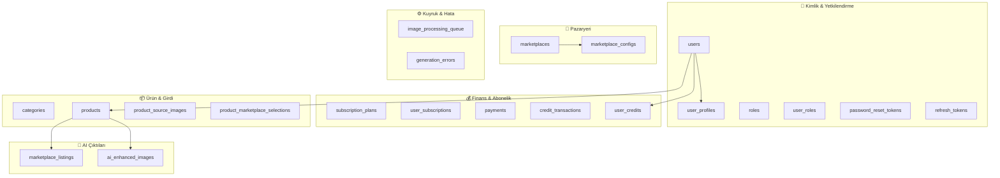
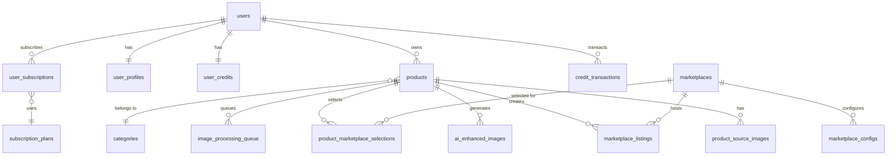
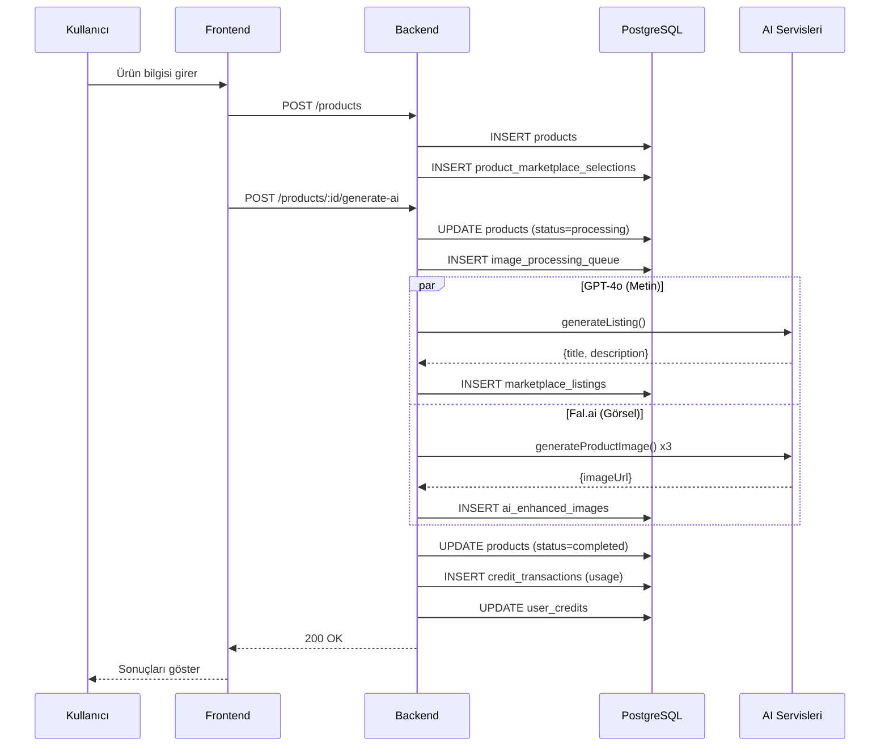

# 🗄️ YAVER - Veritabanı Mimarisi

Bu döküman, YAVER platformunun veritabanı yapısını, tablolarını ve ilişkilerini açıklar.

---

## 📊 Genel Bakış

YAVER, **21 tablo** ve **6 ana modül** üzerine kurulu PostgreSQL veritabanı kullanmaktadır.



---

## 🔐 MODÜL 1: Kimlik ve Yetkilendirme

### users
**Amaç:** Kullanıcı hesaplarını saklar.

| Sütun | Tip | Açıklama |
|-------|-----|----------|
| id | SERIAL | Birincil anahtar |
| email | VARCHAR(255) | Benzersiz e-posta |
| password_hash | TEXT | Şifrelenmiş parola |
| created_at | TIMESTAMP | Oluşturulma tarihi |
| updated_at | TIMESTAMP | Güncellenme tarihi |

**İlişkiler:**
- 1:1 → `user_profiles`
- 1:1 → `user_credits`
- 1:N → `products`
- 1:N → `user_subscriptions`

---

### user_profiles
**Amaç:** Kullanıcı profil bilgilerini saklar.

| Sütun | Tip | Açıklama |
|-------|-----|----------|
| user_id | INTEGER | FK → users.id |
| first_name | VARCHAR(100) | Ad |
| last_name | VARCHAR(100) | Soyad |
| phone_number | VARCHAR(20) | Telefon |
| company_name | VARCHAR(255) | Şirket adı |

**İlişkiler:**
- N:1 → `users`

---

### roles
**Amaç:** Sistem rollerini tanımlar (admin, user vb.)

| Sütun | Tip | Açıklama |
|-------|-----|----------|
| id | SERIAL | Birincil anahtar |
| role_name | VARCHAR(50) | Rol adı (benzersiz) |

---

### user_roles
**Amaç:** Kullanıcı-rol eşleştirmesi (Many-to-Many)

| Sütun | Tip | Açıklama |
|-------|-----|----------|
| user_id | INTEGER | FK → users.id |
| role_id | INTEGER | FK → roles.id |

**Birincil Anahtar:** (user_id, role_id)

---

### password_reset_tokens
**Amaç:** Şifre sıfırlama tokenlarını saklar.

| Sütun | Tip | Açıklama |
|-------|-----|----------|
| id | SERIAL | Birincil anahtar |
| user_id | INTEGER | FK → users.id |
| token | VARCHAR(255) | Benzersiz token |
| expires_at | TIMESTAMP | Son kullanma tarihi |
| used | BOOLEAN | Kullanıldı mı? |

---

### refresh_tokens
**Amaç:** JWT refresh tokenlarını saklar.

| Sütun | Tip | Açıklama |
|-------|-----|----------|
| id | SERIAL | Birincil anahtar |
| user_id | INTEGER | FK → users.id |
| token | VARCHAR(500) | Refresh token |
| expires_at | TIMESTAMP | Son kullanma tarihi |
| revoked | BOOLEAN | İptal edildi mi? |

---

## 💰 MODÜL 2: Finans ve Abonelik

### subscription_plans
**Amaç:** Abonelik planlarını tanımlar.

| Sütun | Tip | Açıklama |
|-------|-----|----------|
| id | SERIAL | Birincil anahtar |
| name | VARCHAR(100) | Plan adı (Starter, Pro, Enterprise) |
| price | INTEGER | Fiyat (kuruş) |
| monthly_credit_limit | INTEGER | Aylık kredi limiti |

**Örnek Veriler:**
- Starter: 0₺, 10 kredi
- Pro: 299₺, 100 kredi
- Enterprise: 999₺, 500 kredi

---

### user_subscriptions
**Amaç:** Kullanıcı aboneliklerini takip eder.

| Sütun | Tip | Açıklama |
|-------|-----|----------|
| id | SERIAL | Birincil anahtar |
| user_id | INTEGER | FK → users.id |
| plan_id | INTEGER | FK → subscription_plans.id |
| start_date | TIMESTAMP | Başlangıç tarihi |
| end_date | TIMESTAMP | Bitiş tarihi |
| is_active | BOOLEAN | Aktif mi? |

---

### user_credits
**Amaç:** Kullanıcı kredi bakiyesini saklar.

| Sütun | Tip | Açıklama |
|-------|-----|----------|
| user_id | INTEGER | PK, FK → users.id |
| subscription_credits | INTEGER | Aylık yenilenen kredi |
| extra_credits | INTEGER | Satın alınan ekstra kredi |
| total_earned | INTEGER | Toplam kazanılan |
| total_spent | INTEGER | Toplam harcanan |
| last_refill_date | TIMESTAMP | Son yenileme tarihi |

**Önemli:** `subscription_credits` her ay sıfırlanır, `extra_credits` birikir.

---

### credit_transactions
**Amaç:** Kredi hareketlerini loglar.

| Sütun | Tip | Açıklama |
|-------|-----|----------|
| id | SERIAL | Birincil anahtar |
| user_id | INTEGER | FK → users.id |
| amount | INTEGER | Miktar (+/-) |
| transaction_type | ENUM | purchase, monthly_refill, usage, bonus |
| description | TEXT | Açıklama |
| related_product_id | INTEGER | İlgili ürün ID |

---

### payments
**Amaç:** Ödeme kayıtlarını saklar.

| Sütun | Tip | Açıklama |
|-------|-----|----------|
| id | SERIAL | Birincil anahtar |
| user_id | INTEGER | FK → users.id |
| amount | INTEGER | Ödeme tutarı |
| payment_date | TIMESTAMP | Ödeme tarihi |

---

## 🏪 MODÜL 3: Pazaryeri Entegrasyonu

### marketplaces
**Amaç:** Desteklenen pazaryerlerini tanımlar.

| Sütun | Tip | Açıklama |
|-------|-----|----------|
| id | SERIAL | Birincil anahtar |
| name | VARCHAR(100) | Pazaryeri adı |
| api_base_url | VARCHAR(255) | API adresi |
| logo_url | VARCHAR(255) | Logo URL |

**Desteklenen Pazaryerleri:**
- 🟠 Trendyol
- 🟣 Hepsiburada
- 🟡 Amazon

---

### marketplace_configs
**Amaç:** Pazaryeri kurallarını saklar.

| Sütun | Tip | Açıklama |
|-------|-----|----------|
| id | SERIAL | Birincil anahtar |
| marketplace_id | INTEGER | FK → marketplaces.id |
| config | JSONB | Konfigürasyon |

**Config Örneği:**
```json
{
  "max_title_length": 150,
  "description_max_length": 5000,
  "language": "tr",
  "banned_words": ["en iyi", "garantili"],
  "credit_cost": 2
}
```

---

## 📦 MODÜL 4: Ürün ve Girdi

### categories
**Amaç:** Ürün kategorilerini tanımlar.

| Sütun | Tip | Açıklama |
|-------|-----|----------|
| id | SERIAL | Birincil anahtar |
| parent_id | INTEGER | Üst kategori (self-ref) |
| name | VARCHAR(255) | Kategori adı |

**Hiyerarşi Desteği:** Alt kategoriler için `parent_id` kullanılır.

---

### products
**Amaç:** Kullanıcı ürünlerini saklar.

| Sütun | Tip | Açıklama |
|-------|-----|----------|
| id | SERIAL | Birincil anahtar |
| user_id | INTEGER | FK → users.id |
| category_id | INTEGER | FK → categories.id |
| brand_name | VARCHAR(255) | Marka adı |
| raw_user_prompt | TEXT | Kullanıcının girdiği açıklama |
| product_status | ENUM | draft, processing, completed, failed |

**Status Akışı:**
```
draft → processing → completed
                  ↘ failed
```

---

### product_source_images
**Amaç:** Kullanıcının yüklediği orijinal görselleri saklar.

| Sütun | Tip | Açıklama |
|-------|-----|----------|
| id | SERIAL | Birincil anahtar |
| product_id | INTEGER | FK → products.id |
| image_url | VARCHAR(512) | Görsel URL |

---

### product_marketplace_selections
**Amaç:** Ürün için seçilen pazaryerlerini saklar.

| Sütun | Tip | Açıklama |
|-------|-----|----------|
| product_id | INTEGER | FK → products.id |
| marketplace_id | INTEGER | FK → marketplaces.id |
| is_selected | BOOLEAN | Seçili mi? |

**Birincil Anahtar:** (product_id, marketplace_id)

---

## 🤖 MODÜL 5: AI Çıktıları

### marketplace_listings
**Amaç:** AI ile üretilen başlık ve açıklamaları saklar.

| Sütun | Tip | Açıklama |
|-------|-----|----------|
| id | SERIAL | Birincil anahtar |
| product_id | INTEGER | FK → products.id |
| marketplace_id | INTEGER | FK → marketplaces.id |
| generated_title | VARCHAR(500) | AI üretimi başlık |
| generated_description | TEXT | AI üretimi açıklama |
| listing_status | ENUM | draft, published, error |

**AI Motor:** GPT-4o

---

### ai_enhanced_images
**Amaç:** AI ile üretilen görselleri saklar.

| Sütun | Tip | Açıklama |
|-------|-----|----------|
| id | SERIAL | Birincil anahtar |
| product_id | INTEGER | FK → products.id |
| image_url | VARCHAR(512) | Üretilen görsel URL |
| image_type | VARCHAR(50) | lifestyle, infographic, detail |
| prompt | TEXT | Kullanılan prompt |
| status | VARCHAR(20) | pending, completed, failed |
| metadata | JSONB | Ek bilgiler |

**AI Motor:** Fal.ai (Nano Banana Pro)

**3 Görsel Tipi:**
| Tip | Açıklama |
|-----|----------|
| lifestyle | Ürünün kullanım ortamında gösterimi |
| infographic | Özellik ve teknik detayların görseli |
| detail | Yakın çekim, doku ve malzeme detayı |

---

## ⚙️ MODÜL 6: İşleme Kuyruğu ve Hata Yönetimi

### image_processing_queue
**Amaç:** Asenkron görsel üretim işlerini yönetir.

| Sütun | Tip | Açıklama |
|-------|-----|----------|
| id | SERIAL | Birincil anahtar |
| product_id | INTEGER | FK → products.id |
| source_image_url | VARCHAR(512) | Kaynak görsel |
| status | ENUM | pending, processing, completed, failed |
| gemini_job_id | VARCHAR(255) | Harici iş ID |
| retry_count | INTEGER | Yeniden deneme sayısı |

**Kuyruk İş Akışı:**
```
pending → processing → completed
                    ↘ failed (max 3 retry)
```

---

### generation_errors
**Amaç:** AI üretim hatalarını loglar.

| Sütun | Tip | Açıklama |
|-------|-----|----------|
| id | SERIAL | Birincil anahtar |
| product_id | INTEGER | FK → products.id |
| marketplace_id | INTEGER | FK → marketplaces.id |
| error_type | VARCHAR(100) | Hata tipi |
| error_message | TEXT | Hata mesajı |
| retry_count | INTEGER | Deneme sayısı |
| resolved | BOOLEAN | Çözüldü mü? |
| last_retry_at | TIMESTAMP | Son deneme tarihi |

---

## 🔗 İlişki Diyagramı (ER)



---

## 📈 Veri Akışı



---

## 🔑 Önemli İndeksler

| Tablo | İndeks | Amaç |
|-------|--------|------|
| products | user_id, created_at | Kullanıcı ürünlerini hızlı listeleme |
| credit_transactions | user_id, created_at | Kredi geçmişini hızlı sorgulama |
| marketplace_listings | product_id, marketplace_id | Listing aramalarını hızlandırma |
| password_reset_tokens | token | Token doğrulamayı hızlandırma |
| refresh_tokens | token | Token doğrulamayı hızlandırma |

---

## 📊 Tablo Sayıları Özeti

| Modül | Tablo Sayısı |
|-------|--------------|
| Kimlik & Yetkilendirme | 6 |
| Finans & Abonelik | 5 |
| Pazaryeri | 2 |
| Ürün & Girdi | 4 |
| AI Çıktıları | 2 |
| Kuyruk & Hata | 2 |
| **TOPLAM** | **21** |

---

**📅 Oluşturulma Tarihi:** 15 Aralık 2025  
**🔧 Teknoloji:** PostgreSQL + Drizzle ORM  
**🏗️ Mimari:** Modüler, İlişkisel
