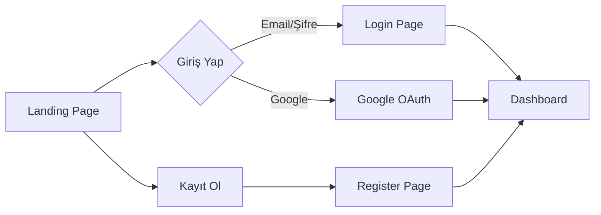
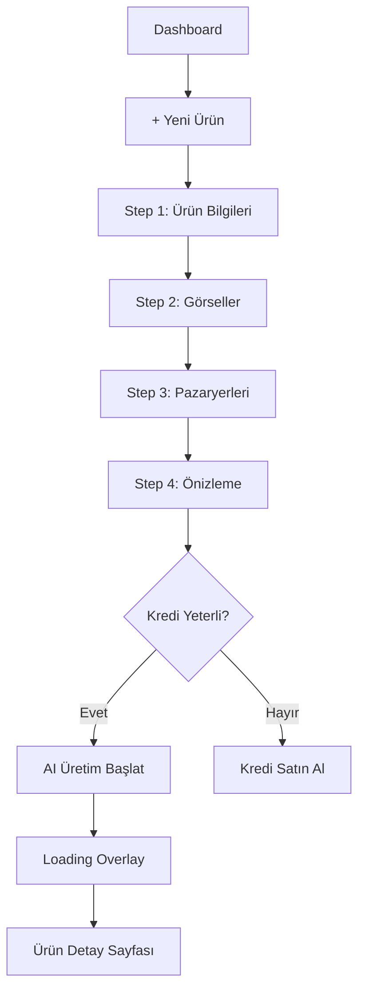

# 🎨 YAVER - Frontend Mimarisi

Bu döküman, YAVER platformunun frontend yapısını, bileşenlerini ve sayfa akışlarını açıklar.

---

## 📊 Genel Bakış

| Özellik | Değer |
|---------|-------|
| **Framework** | Next.js 16 (App Router) |
| **Dil** | TypeScript |
| **Styling** | Tailwind CSS |
| **Animasyon** | Framer Motion |
| **İkon** | Lucide React |
| **State** | React Hooks + Context |
| **Port** | 3001 |

---

## 📁 Klasör Yapısı

```
frontend/src/
├── app/                         # Next.js App Router
│   ├── layout.tsx               # Root layout
│   ├── page.tsx                 # Landing page
│   ├── login/page.tsx           # Giriş sayfası
│   ├── register/page.tsx        # Kayıt sayfası
│   └── dashboard/               # Dashboard (korumalı)
│       ├── layout.tsx           # Dashboard layout
│       ├── page.tsx             # Ana dashboard
│       ├── products/            # Ürün yönetimi
│       │   ├── page.tsx         # Ürün listesi
│       │   ├── new/page.tsx     # Yeni ürün
│       │   └── [id]/page.tsx    # Ürün detayı
│       ├── credits/page.tsx     # Kredi sayfası
│       ├── payment/page.tsx     # Ödeme sayfası
│       └── settings/page.tsx    # Ayarlar
│
├── components/                  # Bileşenler
│   ├── ui/                      # Genel UI bileşenleri
│   │   ├── Button.tsx
│   │   ├── Card.tsx
│   │   ├── Modal.tsx
│   │   └── Notifications.tsx
│   ├── landing/                 # Landing page bileşenleri
│   │   ├── Hero.tsx
│   │   ├── Features.tsx
│   │   ├── HowItWorks.tsx
│   │   ├── Pricing.tsx
│   │   └── Footer.tsx
│   └── dashboard/               # Dashboard bileşenleri
│       ├── Sidebar.tsx
│       ├── Header.tsx
│       └── StatsCard.tsx
│
├── hooks/                       # Custom hooks
│   ├── useAuth.ts               # Auth context
│   ├── useCredits.ts            # Kredi yönetimi
│   └── useProducts.ts           # Ürün hookları
│
├── lib/                         # Yardımcı fonksiyonlar
│   ├── api.ts                   # API client
│   └── utils.ts                 # Utility fonksiyonları
│
└── types/                       # TypeScript tipleri
    └── index.ts
```

---

## 🎯 Sayfa Akışları

### Landing Page → Dashboard Akışı



### Ürün Oluşturma Akışı



---

## 📱 Sayfalar

### 1. Landing Page (`/`)

**Bileşenler:**
- `Hero`: Ana banner, CTA butonları
- `Features`: Özellik kartları (BentoGrid)
- `HowItWorks`: 4 adımlı akış gösterimi
- `Pricing`: Fiyatlandırma planları
- `Footer`: Alt bilgi

**Özellikler:**
- Scroll animasyonları
- Responsive tasarım
- Dark tema

---

### 2. Login Page (`/login`)

**Özellikler:**
- Email/Şifre girişi
- Google OAuth butonu
- "Şifremi Unuttum" linki
- Form validasyonu

---

### 3. Dashboard (`/dashboard`)

**Layout Bileşenleri:**
- `Sidebar`: Navigasyon menüsü
- `Header`: Arama, kredi göstergesi, profil

**Ana Sayfa Widgets:**
| Widget | Açıklama |
|--------|----------|
| Kredi Bakiyesi | Mevcut kredi |
| Son Ürünler | Son 4 ürün kartı |
| Pazaryerleri | Entegre platformlar |
| Kuyruk Durumu | Bekleyen işler |

---

### 4. Products Page (`/dashboard/products`)

**Görünüm Modları:**
- 📊 Grid View (varsayılan)
- 📋 List View

**Özellikler:**
- Pagination
- Status filtreleme
- AI görsel thumbnail

**ProductCard Bileşeni:**
```tsx
<ProductCard>
  <Image src={enhancedImages[0] || sourceImages[0]} />
  <StatusBadge status={productStatus} />
  <Title>{brandName}</Title>
  <MarketplaceCount>{listings.length}</MarketplaceCount>
</ProductCard>
```

---

### 5. New Product Page (`/dashboard/products/new`)

**4 Adımlı Wizard:**

| Adım | Başlık | İçerik |
|------|--------|--------|
| 1 | Ürün Bilgileri | Marka, Kategori, Açıklama |
| 2 | Görseller | Görsel yükleme (opsiyonel) |
| 3 | Pazaryerleri | Trendyol, Hepsiburada, Amazon |
| 4 | Önizleme | Özet + Kredi maliyeti |

**Loading Overlay:**
```tsx
{isSubmitting && (
  <FullScreenOverlay>
    <Spinner />
    <Message>{generatingMessage}</Message>
  </FullScreenOverlay>
)}
```

---

### 6. Product Detail Page (`/dashboard/products/[id]`)

**Sol Panel:**
- AI Görselleri (tıklanabilir lightbox)
- Ürün detayları

**Sağ Panel:**
- Pazaryeri İçerikleri
  - Trendyol (Başlık + Açıklama)
  - Hepsiburada (Başlık + Açıklama)
  - Amazon (Başlık + Açıklama)
- Kopyala butonları

**Auto-Polling:**
```tsx
useEffect(() => {
  if (product?.productStatus === 'processing') {
    const interval = setInterval(() => refetch(), 3000);
    return () => clearInterval(interval);
  }
}, [product?.productStatus]);
```

---

### 7. Credits Page (`/dashboard/credits`)

**Gösterimler:**
- Mevcut bakiye (subscription + extra)
- Kredi geçmişi tablosu
- Satın alma butonları

---

## 🪝 Custom Hooks

### useAuth
```typescript
const { user, isAuthenticated, login, logout, loading } = useAuth();
```

### useCredits
```typescript
const { balance, history, refetch, purchase } = useCredits();
```

### useProducts
```typescript
const { products, isLoading, error, refetch } = useProducts(page, limit);
const { product, isLoading, refetch } = useProduct(id);
```

---

## 🔌 API Client

**Dosya:** `src/lib/api.ts`

```typescript
// Base client
const api = new ApiClient(API_BASE_URL);

// Convenience methods
export const authApi = {
  login: (email, password) => api.post('/auth/login', { email, password }),
  register: (data) => api.post('/auth/register', data),
  me: () => api.get('/auth/me'),
};

export const productsApi = {
  list: (page, limit) => api.get('/products', { page, limit }),
  get: (id) => api.get(`/products/${id}`),
  create: (data) => api.post('/products', data),
  generateAI: (id) => api.post(`/products/${id}/generate-ai`),
};

export const creditsApi = {
  getBalance: () => api.get('/credits'),
  getHistory: (limit) => api.get('/credits/history', { limit }),
  purchase: (amount) => api.post('/credits/purchase', { amount }),
};
```

**Auto Token Refresh:**
```typescript
if (response.status === 401) {
  const refreshed = await this.refreshTokens();
  if (refreshed) {
    return this.request(endpoint, options); // Retry
  } else {
    redirect('/login');
  }
}
```

---

## 🎨 UI Bileşenleri

### Toast Notifications
```tsx
<Toast
  type="success" // success | error | info | warning
  title="Başarılı"
  message="İşlem tamamlandı"
  isVisible={true}
  onClose={hideToast}
/>
```

### Status Badge
```tsx
const statusConfig = {
  draft: { label: 'Taslak', color: 'text-yellow-400', icon: Clock },
  processing: { label: 'İşleniyor', color: 'text-blue-400', icon: Loader2 },
  completed: { label: 'Tamamlandı', color: 'text-green-400', icon: CheckCircle },
  failed: { label: 'Başarısız', color: 'text-red-400', icon: AlertCircle },
};
```

### Image Lightbox
```tsx
<AnimatePresence>
  {selectedImage && (
    <motion.div className="fixed inset-0 z-50 bg-black/90">
      
      <Button onClick={download}>İndir</Button>
    </motion.div>
  )}
</AnimatePresence>
```

---

## 🎭 Animasyonlar

### Framer Motion Kullanımı

```tsx
// Fade in
<motion.div
  initial={{ opacity: 0, y: 20 }}
  animate={{ opacity: 1, y: 0 }}
  transition={{ delay: index * 0.05 }}
>

// Hover effect
<motion.div whileHover={{ y: -4, scale: 1.02 }}>

// Page transitions
<AnimatePresence mode="wait">
  {currentStep === 1 && <StepOne key="step1" />}
</AnimatePresence>
```

---

## 📱 Responsive Tasarım

| Breakpoint | Prefix | Ekran |
|------------|--------|-------|
| < 640px | (default) | Mobile |
| ≥ 640px | `sm:` | Tablet |
| ≥ 768px | `md:` | Small laptop |
| ≥ 1024px | `lg:` | Desktop |
| ≥ 1280px | `xl:` | Large desktop |

**Örnek:**
```tsx
<div className="grid grid-cols-1 md:grid-cols-2 lg:grid-cols-3 gap-4">
```

---

## 🌙 Tema

**Renk Paleti (Dark Mode):**
| Renk | Kod | Kullanım |
|------|-----|----------|
| Background | `#0a0a0a` | Sayfa arka planı |
| Card | `rgba(255,255,255,0.02)` | Kart arka planı |
| Border | `rgba(255,255,255,0.08)` | Kenar çizgileri |
| Text Primary | `#ffffff` | Ana metin |
| Text Secondary | `rgba(255,255,255,0.5)` | İkincil metin |
| Accent | `#6366f1` | Indigo (butonlar) |
| Success | `#22c55e` | Yeşil |
| Error | `#ef4444` | Kırmızı |

---

## 🔐 Korumalı Rotalar

```tsx
// Dashboard layout
export default function DashboardLayout({ children }) {
  const { isAuthenticated, loading } = useAuth();
  
  if (loading) return <Spinner />;
  if (!isAuthenticated) redirect('/login');
  
  return (
    <div className="flex">
      <Sidebar />
      <main>{children}</main>
    </div>
  );
}
```

---

## 🔧 Environment Variables

| Değişken | Açıklama |
|----------|----------|
| `NEXT_PUBLIC_API_URL` | Backend API URL |
| `NEXT_PUBLIC_GOOGLE_CLIENT_ID` | Google OAuth |

---

## 🚀 Çalıştırma

```bash
# Development
npm run dev
# veya
bun run dev

# Build
npm run build

# Production
npm run start
```

---

## 📊 Performans Optimizasyonları

- ✅ Next.js App Router (Server Components)
- ✅ Turbopack (Hızlı development)
- ✅ Image Optimization
- ✅ Code Splitting
- ✅ Lazy Loading (Modal, Lightbox)

---

**📅 Güncelleme:** 16 Aralık 2025  
**🏗️ Mimari:** Component-Based, SSR + CSR Hybrid
