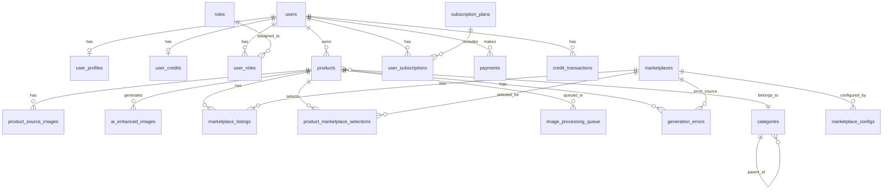

# SellerAI - Veritabanı Yönetim Sistemleri Proje Sunumu

**Proje:** SellerAI - AI Destekli E-Ticaret İçerik Üretim Platformu  
**Ders:** Veritabanı Yönetim Sistemleri  
**Teknolojiler:** PostgreSQL, Drizzle ORM, TypeScript

---

## 1. Proje Özeti

SellerAI, e-ticaret satıcılarının ürün listelemelerini yapay zeka ile optimize etmesini sağlayan bir SaaS platformudur.

### Temel Özellikler:
- 🔐 **Kullanıcı Yönetimi:** Kayıt, giriş, rol tabanlı yetkilendirme
- 💳 **Kredi Sistemi:** Abonelik bazlı ve satın alınabilir kredi yönetimi
- 🛒 **Çoklu Pazaryeri:** Amazon, Trendyol, Hepsiburada desteği
- 🤖 **AI İçerik Üretimi:** GPT-4 ile SEO optimize başlık/açıklama
- 🖼️ **Görsel İşleme:** AI ile ürün görseli iyileştirme

---

## 2. Veritabanı Mimarisi

### 2.1 Kullanılan DBMS
- **PostgreSQL 15** - Açık kaynak, ACID uyumlu ilişkisel veritabanı
- **Drizzle ORM** - Type-safe TypeScript ORM

### 2.2 Modüler Yapı

Veritabanı 6 ana modüle ayrılmıştır:

| Modül | Tablo Sayısı | Açıklama |
|-------|--------------|----------|
| Kimlik & Yetkilendirme | 5 | Kullanıcı, profil, rol yönetimi |
| Finans & Abonelik | 5 | Kredi, ödeme, abonelik sistemi |
| Pazaryeri Entegrasyonu | 2 | Marketplace konfigürasyonları |
| Ürün & Girdi | 4 | Ürün ve görsel yönetimi |
| AI Çıktıları | 2 | Üretilen içerik ve görseller |
| İşleme Kuyruğu | 2 | Asenkron iş ve hata takibi |

**Toplam: 20 Tablo**

---

## 3. ER Diyagramı (Entity-Relationship)



---

## 4. Tablo Yapıları ve İlişkiler

### 4.1 MODÜL 1: Kimlik ve Yetkilendirme

#### users (Kullanıcılar)
```sql
CREATE TABLE users (
    id SERIAL PRIMARY KEY,
    email VARCHAR(255) NOT NULL UNIQUE,
    password_hash TEXT NOT NULL,
    created_at TIMESTAMP NOT NULL DEFAULT NOW(),
    updated_at TIMESTAMP NOT NULL DEFAULT NOW()
);
```

| Kolon | Tip | Kısıtlamalar | Açıklama |
|-------|-----|--------------|----------|
| id | SERIAL | PK | Otomatik artan kimlik |
| email | VARCHAR(255) | NOT NULL, UNIQUE | Kullanıcı e-postası |
| password_hash | TEXT | NOT NULL | Bcrypt ile şifrelenmiş parola |
| created_at | TIMESTAMP | NOT NULL, DEFAULT NOW() | Oluşturma tarihi |
| updated_at | TIMESTAMP | NOT NULL, DEFAULT NOW() | Güncelleme tarihi |

#### user_profiles (Kullanıcı Profilleri)
```sql
CREATE TABLE user_profiles (
    user_id INTEGER PRIMARY KEY REFERENCES users(id) ON DELETE CASCADE,
    first_name VARCHAR(100),
    last_name VARCHAR(100),
    phone_number VARCHAR(20),
    company_name VARCHAR(255),
    created_at TIMESTAMP NOT NULL DEFAULT NOW(),
    updated_at TIMESTAMP NOT NULL DEFAULT NOW()
);
```
**İlişki:** users → user_profiles (1:1)

#### roles (Roller)
```sql
CREATE TABLE roles (
    id SERIAL PRIMARY KEY,
    role_name VARCHAR(50) NOT NULL UNIQUE,
    created_at TIMESTAMP NOT NULL DEFAULT NOW(),
    updated_at TIMESTAMP NOT NULL DEFAULT NOW()
);

-- Örnek veriler:
INSERT INTO roles (role_name) VALUES ('user'), ('admin'), ('moderator');
```

#### user_roles (Kullanıcı-Rol İlişkisi)
```sql
CREATE TABLE user_roles (
    user_id INTEGER NOT NULL REFERENCES users(id) ON DELETE CASCADE,
    role_id INTEGER NOT NULL REFERENCES roles(id) ON DELETE CASCADE,
    created_at TIMESTAMP NOT NULL DEFAULT NOW(),
    updated_at TIMESTAMP NOT NULL DEFAULT NOW(),
    PRIMARY KEY (user_id, role_id)
);
```
**İlişki:** users ↔ roles (M:N - Many-to-Many)

#### refresh_tokens (Yenileme Tokenları)
```sql
CREATE TABLE refresh_tokens (
    id SERIAL PRIMARY KEY,
    user_id INTEGER NOT NULL REFERENCES users(id) ON DELETE CASCADE,
    token VARCHAR(500) NOT NULL UNIQUE,
    expires_at TIMESTAMP NOT NULL,
    revoked BOOLEAN NOT NULL DEFAULT FALSE,
    created_at TIMESTAMP NOT NULL DEFAULT NOW()
);

CREATE INDEX refresh_token_user_idx ON refresh_tokens(user_id);
CREATE INDEX refresh_token_idx ON refresh_tokens(token);
```

---

### 4.2 MODÜL 2: Finans ve Abonelik

#### subscription_plans (Abonelik Planları)
```sql
CREATE TABLE subscription_plans (
    id SERIAL PRIMARY KEY,
    name VARCHAR(100) NOT NULL,
    price INTEGER NOT NULL,
    monthly_credit_limit INTEGER NOT NULL,
    created_at TIMESTAMP NOT NULL DEFAULT NOW(),
    updated_at TIMESTAMP NOT NULL DEFAULT NOW()
);

-- Örnek veriler:
INSERT INTO subscription_plans (name, price, monthly_credit_limit) VALUES
    ('Free', 0, 10),
    ('Basic', 99, 100),
    ('Pro', 299, 500),
    ('Enterprise', 999, 2000);
```

#### user_subscriptions (Kullanıcı Abonelikleri)
```sql
CREATE TABLE user_subscriptions (
    id SERIAL PRIMARY KEY,
    user_id INTEGER NOT NULL REFERENCES users(id) ON DELETE CASCADE,
    plan_id INTEGER NOT NULL REFERENCES subscription_plans(id),
    start_date TIMESTAMP NOT NULL,
    end_date TIMESTAMP,
    is_active BOOLEAN NOT NULL DEFAULT TRUE,
    created_at TIMESTAMP NOT NULL DEFAULT NOW(),
    updated_at TIMESTAMP NOT NULL DEFAULT NOW()
);
```

#### user_credits (Kullanıcı Kredileri)
```sql
CREATE TABLE user_credits (
    user_id INTEGER PRIMARY KEY REFERENCES users(id) ON DELETE CASCADE,
    subscription_credits INTEGER NOT NULL DEFAULT 0,  -- Aylık yenilenen
    extra_credits INTEGER NOT NULL DEFAULT 0,         -- Satın alınan
    total_earned INTEGER NOT NULL DEFAULT 0,
    total_spent INTEGER NOT NULL DEFAULT 0,
    last_refill_date TIMESTAMP,
    updated_at TIMESTAMP NOT NULL DEFAULT NOW()
);
```

#### credit_transactions (Kredi İşlemleri)
```sql
CREATE TYPE transaction_type AS ENUM ('purchase', 'monthly_refill', 'usage', 'bonus');

CREATE TABLE credit_transactions (
    id SERIAL PRIMARY KEY,
    user_id INTEGER NOT NULL REFERENCES users(id) ON DELETE CASCADE,
    amount INTEGER NOT NULL,  -- Pozitif: ekleme, Negatif: harcama
    transaction_type transaction_type NOT NULL,
    description TEXT,
    related_product_id INTEGER,
    created_at TIMESTAMP NOT NULL DEFAULT NOW()
);

CREATE INDEX credit_trans_user_created_idx ON credit_transactions(user_id, created_at);
```

---

### 4.3 MODÜL 3: Pazaryeri Entegrasyonu

#### marketplaces (Pazaryerleri)
```sql
CREATE TABLE marketplaces (
    id SERIAL PRIMARY KEY,
    name VARCHAR(100) NOT NULL UNIQUE,
    api_base_url VARCHAR(255),
    logo_url VARCHAR(255),
    created_at TIMESTAMP NOT NULL DEFAULT NOW(),
    updated_at TIMESTAMP NOT NULL DEFAULT NOW()
);

-- Örnek veriler:
INSERT INTO marketplaces (name, logo_url) VALUES
    ('Amazon', '/logos/amazon.svg'),
    ('Trendyol', '/logos/trendyol.svg'),
    ('Hepsiburada', '/logos/hepsiburada.svg');
```

#### marketplace_configs (Pazaryeri Konfigürasyonları)
```sql
CREATE TABLE marketplace_configs (
    id SERIAL PRIMARY KEY,
    marketplace_id INTEGER NOT NULL REFERENCES marketplaces(id) ON DELETE CASCADE,
    config JSONB NOT NULL,  -- Esnek konfigürasyon
    created_at TIMESTAMP NOT NULL DEFAULT NOW(),
    updated_at TIMESTAMP NOT NULL DEFAULT NOW()
);

-- Örnek JSONB config:
-- {
--   "max_title_length": 200,
--   "description_max_length": 5000,
--   "language": "tr",
--   "credit_cost": 2,
--   "banned_words": ["yasak", "kelime"]
-- }
```

---

### 4.4 MODÜL 4: Ürün ve Girdi

#### categories (Kategoriler - Self-Referencing)
```sql
CREATE TABLE categories (
    id SERIAL PRIMARY KEY,
    parent_id INTEGER REFERENCES categories(id),  -- Self-referencing FK
    name VARCHAR(255) NOT NULL,
    created_at TIMESTAMP NOT NULL DEFAULT NOW(),
    updated_at TIMESTAMP NOT NULL DEFAULT NOW()
);

CREATE INDEX category_parent_idx ON categories(parent_id);

-- Hiyerarşik kategori örneği:
-- Elektronik (parent_id: NULL)
--   └── Telefonlar (parent_id: 1)
--       └── Akıllı Telefonlar (parent_id: 2)
```

#### products (Ürünler)
```sql
CREATE TYPE product_status AS ENUM ('draft', 'processing', 'completed', 'failed');

CREATE TABLE products (
    id SERIAL PRIMARY KEY,
    user_id INTEGER NOT NULL REFERENCES users(id) ON DELETE CASCADE,
    category_id INTEGER REFERENCES categories(id),
    brand_name VARCHAR(255),
    raw_user_prompt TEXT,  -- Kullanıcının girdiği ürün açıklaması
    product_status product_status NOT NULL DEFAULT 'draft',
    created_at TIMESTAMP NOT NULL DEFAULT NOW(),
    updated_at TIMESTAMP NOT NULL DEFAULT NOW()
);

CREATE INDEX products_user_created_idx ON products(user_id, created_at);
```

#### product_source_images (Kaynak Görseller)
```sql
CREATE TABLE product_source_images (
    id SERIAL PRIMARY KEY,
    product_id INTEGER NOT NULL REFERENCES products(id) ON DELETE CASCADE,
    image_url VARCHAR(512) NOT NULL,
    created_at TIMESTAMP NOT NULL DEFAULT NOW(),
    updated_at TIMESTAMP NOT NULL DEFAULT NOW()
);
```

#### product_marketplace_selections (Pazaryeri Seçimleri)
```sql
CREATE TABLE product_marketplace_selections (
    product_id INTEGER NOT NULL REFERENCES products(id) ON DELETE CASCADE,
    marketplace_id INTEGER NOT NULL REFERENCES marketplaces(id) ON DELETE CASCADE,
    is_selected BOOLEAN NOT NULL DEFAULT TRUE,
    created_at TIMESTAMP NOT NULL DEFAULT NOW(),
    updated_at TIMESTAMP NOT NULL DEFAULT NOW(),
    PRIMARY KEY (product_id, marketplace_id)
);
```
**İlişki:** products ↔ marketplaces (M:N)

---

### 4.5 MODÜL 5: AI Çıktıları

#### marketplace_listings (Pazaryeri Listemeleri)
```sql
CREATE TYPE listing_status AS ENUM ('draft', 'published', 'error');

CREATE TABLE marketplace_listings (
    id SERIAL PRIMARY KEY,
    product_id INTEGER NOT NULL REFERENCES products(id) ON DELETE CASCADE,
    marketplace_id INTEGER NOT NULL REFERENCES marketplaces(id) ON DELETE CASCADE,
    generated_title VARCHAR(500),
    generated_description TEXT,
    listing_status listing_status NOT NULL DEFAULT 'draft',
    created_at TIMESTAMP NOT NULL DEFAULT NOW(),
    updated_at TIMESTAMP NOT NULL DEFAULT NOW()
);

CREATE INDEX listings_product_marketplace_idx ON marketplace_listings(product_id, marketplace_id);
```

#### ai_enhanced_images (AI İyileştirilmiş Görseller)
```sql
CREATE TABLE ai_enhanced_images (
    id SERIAL PRIMARY KEY,
    product_id INTEGER NOT NULL REFERENCES products(id) ON DELETE CASCADE,
    image_url VARCHAR(512) NOT NULL,
    image_type VARCHAR(50) NOT NULL,  -- 'lifestyle', 'infographic', 'detail'
    prompt TEXT NOT NULL,
    metadata JSONB,
    status VARCHAR(20) DEFAULT 'completed',
    created_at TIMESTAMP NOT NULL DEFAULT NOW(),
    updated_at TIMESTAMP NOT NULL DEFAULT NOW()
);
```

---

### 4.6 MODÜL 6: İşleme Kuyruğu ve Hata Yönetimi

#### image_processing_queue (Görsel İşleme Kuyruğu)
```sql
CREATE TYPE queue_status AS ENUM ('pending', 'processing', 'completed', 'failed');

CREATE TABLE image_processing_queue (
    id SERIAL PRIMARY KEY,
    product_id INTEGER NOT NULL REFERENCES products(id) ON DELETE CASCADE,
    source_image_url VARCHAR(512) NOT NULL,
    status queue_status NOT NULL DEFAULT 'pending',
    gemini_job_id VARCHAR(255),
    retry_count INTEGER NOT NULL DEFAULT 0,
    created_at TIMESTAMP NOT NULL DEFAULT NOW(),
    updated_at TIMESTAMP NOT NULL DEFAULT NOW()
);
```

#### generation_errors (Üretim Hataları)
```sql
CREATE TABLE generation_errors (
    id SERIAL PRIMARY KEY,
    product_id INTEGER NOT NULL REFERENCES products(id) ON DELETE CASCADE,
    marketplace_id INTEGER REFERENCES marketplaces(id),
    error_type VARCHAR(100) NOT NULL,
    error_message TEXT,
    retry_count INTEGER NOT NULL DEFAULT 0,
    resolved BOOLEAN NOT NULL DEFAULT FALSE,
    last_retry_at TIMESTAMP,
    created_at TIMESTAMP NOT NULL DEFAULT NOW(),
    updated_at TIMESTAMP NOT NULL DEFAULT NOW()
);

CREATE INDEX errors_product_marketplace_idx ON generation_errors(product_id, marketplace_id);
```

---

## 5. Normalizasyon Analizi

### 5.1 1NF (Birinci Normal Form) ✅
- Tüm tablolarda atomik değerler kullanılmıştır
- Her hücrede tek bir değer bulunur
- Tekrarlayan gruplar yoktur

### 5.2 2NF (İkinci Normal Form) ✅
- Tüm tablolar 1NF'dedir
- Kısmi bağımlılık yoktur
- Composite PK olan tablolarda (user_roles, product_marketplace_selections) tüm non-key alanlar tam bağımlıdır

### 5.3 3NF (Üçüncü Normal Form) ✅
- Tüm tablolar 2NF'dedir
- Transitif bağımlılık yoktur
- Örnek: user_profiles tablosu users'dan ayrılarak normalize edilmiştir

### 5.4 BCNF (Boyce-Codd Normal Form) ✅
- Her belirleyici (determinant) bir aday anahtardır
- Anormallikler giderilmiştir

---

## 6. İndeksleme Stratejisi

### 6.1 Birincil Anahtar İndeksleri (Otomatik)
Tüm `id` kolonları için PostgreSQL otomatik B-tree indeks oluşturur.

### 6.2 Yabancı Anahtar İndeksleri
```sql
-- Sık sorgulanan ilişkiler için
CREATE INDEX products_user_created_idx ON products(user_id, created_at);
CREATE INDEX credit_trans_user_created_idx ON credit_transactions(user_id, created_at);
CREATE INDEX listings_product_marketplace_idx ON marketplace_listings(product_id, marketplace_id);
```

### 6.3 Token Arama İndeksleri
```sql
CREATE INDEX refresh_token_idx ON refresh_tokens(token);
CREATE INDEX password_reset_token_idx ON password_reset_tokens(token);
```

### 6.4 İndeks Performans Analizi
```sql
-- İndeks kullanımını kontrol et
EXPLAIN ANALYZE SELECT * FROM products WHERE user_id = 1 ORDER BY created_at DESC;

-- Sonuç: Index Scan using products_user_created_idx
```

---

## 7. Örnek SQL Sorguları

### 7.1 CRUD İşlemleri

#### CREATE - Yeni Ürün Oluşturma
```sql
INSERT INTO products (user_id, category_id, brand_name, raw_user_prompt, product_status)
VALUES (1, 5, 'Samsung', 'Samsung Galaxy S24 Ultra 256GB Siyah', 'draft')
RETURNING id, created_at;
```

#### READ - Kullanıcının Ürünlerini Getirme
```sql
SELECT 
    p.id,
    p.brand_name,
    p.product_status,
    c.name as category_name,
    COUNT(ml.id) as listing_count
FROM products p
LEFT JOIN categories c ON p.category_id = c.id
LEFT JOIN marketplace_listings ml ON p.id = ml.product_id
WHERE p.user_id = 1
GROUP BY p.id, c.name
ORDER BY p.created_at DESC
LIMIT 10;
```

#### UPDATE - Ürün Durumu Güncelleme
```sql
UPDATE products 
SET product_status = 'completed', updated_at = NOW()
WHERE id = 1 AND user_id = 1
RETURNING *;
```

#### DELETE - Ürün Silme (Cascade)
```sql
DELETE FROM products WHERE id = 1 AND user_id = 1;
-- İlişkili tüm kayıtlar (source_images, listings, vb.) otomatik silinir
```

### 7.2 JOIN Sorguları

#### Kullanıcı Profili ile Birlikte Getirme
```sql
SELECT 
    u.id,
    u.email,
    up.first_name,
    up.last_name,
    up.company_name,
    uc.subscription_credits + uc.extra_credits as total_credits
FROM users u
LEFT JOIN user_profiles up ON u.id = up.user_id
LEFT JOIN user_credits uc ON u.id = uc.user_id
WHERE u.id = 1;
```

#### Ürün Detayları (Çoklu JOIN)
```sql
SELECT 
    p.id,
    p.brand_name,
    p.raw_user_prompt,
    c.name as category,
    m.name as marketplace,
    ml.generated_title,
    ml.listing_status
FROM products p
LEFT JOIN categories c ON p.category_id = c.id
LEFT JOIN marketplace_listings ml ON p.id = ml.product_id
LEFT JOIN marketplaces m ON ml.marketplace_id = m.id
WHERE p.id = 1;
```

### 7.3 Agregasyon Sorguları

#### Kullanıcı Bazlı İstatistikler
```sql
SELECT 
    u.id,
    u.email,
    COUNT(DISTINCT p.id) as product_count,
    COUNT(DISTINCT ml.id) as listing_count,
    COALESCE(SUM(CASE WHEN ct.amount < 0 THEN ABS(ct.amount) ELSE 0 END), 0) as total_spent
FROM users u
LEFT JOIN products p ON u.id = p.user_id
LEFT JOIN marketplace_listings ml ON p.id = ml.product_id
LEFT JOIN credit_transactions ct ON u.id = ct.user_id
GROUP BY u.id, u.email
ORDER BY product_count DESC;
```

#### Pazaryeri Performans Raporu
```sql
SELECT 
    m.name as marketplace,
    COUNT(ml.id) as total_listings,
    COUNT(CASE WHEN ml.listing_status = 'published' THEN 1 END) as published,
    COUNT(CASE WHEN ml.listing_status = 'draft' THEN 1 END) as drafts,
    COUNT(CASE WHEN ml.listing_status = 'error' THEN 1 END) as errors
FROM marketplaces m
LEFT JOIN marketplace_listings ml ON m.id = ml.marketplace_id
GROUP BY m.id, m.name;
```

### 7.4 Alt Sorgular (Subqueries)

#### En Aktif Kullanıcılar
```sql
SELECT * FROM users 
WHERE id IN (
    SELECT user_id 
    FROM products 
    GROUP BY user_id 
    HAVING COUNT(*) > 5
);
```

#### Son 30 Günde Aktif Abonelikler
```sql
SELECT 
    sp.name as plan_name,
    COUNT(us.id) as subscriber_count
FROM subscription_plans sp
LEFT JOIN user_subscriptions us ON sp.id = us.plan_id
    AND us.is_active = TRUE
    AND us.start_date > NOW() - INTERVAL '30 days'
GROUP BY sp.id, sp.name;
```

### 7.5 CTE (Common Table Expressions)

#### Hiyerarşik Kategori Ağacı
```sql
WITH RECURSIVE category_tree AS (
    -- Base case: Üst seviye kategoriler
    SELECT id, name, parent_id, 0 as level, name::text as path
    FROM categories
    WHERE parent_id IS NULL
    
    UNION ALL
    
    -- Recursive case: Alt kategoriler
    SELECT c.id, c.name, c.parent_id, ct.level + 1, ct.path || ' > ' || c.name
    FROM categories c
    JOIN category_tree ct ON c.parent_id = ct.id
)
SELECT * FROM category_tree ORDER BY path;
```

---

## 8. Veri Bütünlüğü ve Kısıtlamalar

### 8.1 Birincil Anahtar (Primary Key)
- Her tabloda `id SERIAL PRIMARY KEY` veya composite PK tanımlanmıştır
- Benzersizlik garantisi sağlar

### 8.2 Yabancı Anahtar (Foreign Key)
```sql
-- Örnek: ON DELETE CASCADE
user_id INTEGER REFERENCES users(id) ON DELETE CASCADE

-- Kullanıcı silindiğinde ilişkili tüm veriler otomatik silinir:
-- products, user_profiles, credit_transactions, vb.
```

### 8.3 UNIQUE Kısıtlamaları
```sql
email VARCHAR(255) NOT NULL UNIQUE  -- Tekrarsız email
role_name VARCHAR(50) NOT NULL UNIQUE  -- Tekrarsız rol adı
```

### 8.4 CHECK Kısıtlamaları (İş Mantığı)
```sql
-- ORM seviyesinde doğrulama örnekleri:
-- amount must be positive for purchases
-- email must be valid format
-- password minimum 6 characters
```

### 8.5 ENUM Türleri
```sql
CREATE TYPE product_status AS ENUM ('draft', 'processing', 'completed', 'failed');
CREATE TYPE listing_status AS ENUM ('draft', 'published', 'error');
CREATE TYPE transaction_type AS ENUM ('purchase', 'monthly_refill', 'usage', 'bonus');
CREATE TYPE queue_status AS ENUM ('pending', 'processing', 'completed', 'failed');
```

---

## 9. Güvenlik Önlemleri

### 9.1 Şifreleme
```typescript
// Bcrypt ile parola hashleme
const passwordHash = await bcrypt.hash(password, 10);

// Doğrulama
const isValid = await bcrypt.compare(inputPassword, passwordHash);
```

### 9.2 SQL Injection Koruması
```typescript
// Drizzle ORM parametreli sorgular kullanır
const user = await db.query.users.findFirst({
    where: eq(users.email, userInput)  // Güvenli parametre
});
```

### 9.3 JWT Token Güvenliği
- Access Token: 7 gün geçerli
- Refresh Token: Veritabanında saklanır, iptal edilebilir
- Token'lar revoked olarak işaretlenebilir

---

## 10. Performans Optimizasyonları

### 10.1 Bağlantı Havuzu (Connection Pooling)
```typescript
const pool = new Pool({
    connectionString: DATABASE_URL,
    max: 20,  // Maksimum bağlantı sayısı
    idleTimeoutMillis: 30000,
    connectionTimeoutMillis: 2000,
});
```

### 10.2 Sayfalama (Pagination)
```sql
SELECT * FROM products
WHERE user_id = 1
ORDER BY created_at DESC
LIMIT 10 OFFSET 20;
```

### 10.3 Eager Loading (ORM)
```typescript
// İlişkili verileri tek sorguda getir
const product = await db.query.products.findFirst({
    where: eq(products.id, productId),
    with: {
        category: true,
        sourceImages: true,
        listings: {
            with: { marketplace: true }
        }
    }
});
```

---

## 11. Yedekleme ve Kurtarma

### 11.1 Yedekleme Komutu
```bash
# Tam veritabanı yedeği
pg_dump -U sellerai_user -d sellerai_db > backup_$(date +%Y%m%d).sql

# Sıkıştırılmış yedek
pg_dump -U sellerai_user -d sellerai_db | gzip > backup_$(date +%Y%m%d).sql.gz
```

### 11.2 Kurtarma Komutu
```bash
# Yedeği geri yükle
psql -U sellerai_user -d sellerai_db < backup_20241216.sql
```

---

## 12. Sonuç

Bu projede:
- ✅ **20 tablo** ile kapsamlı veritabanı tasarımı yapıldı
- ✅ **6 modül** ile mantıksal gruplandırma sağlandı
- ✅ **3NF/BCNF** normalizasyon uygulandı
- ✅ **İndeksleme** ile sorgu performansı optimize edildi
- ✅ **Referans bütünlüğü** CASCADE kuralları ile korundu
- ✅ **ENUM türleri** ile veri tutarlılığı sağlandı
- ✅ **JSONB** ile esnek konfigürasyon desteği eklendi
- ✅ **Güvenlik** önlemleri (hash, parameterized queries) uygulandı

---

## 13. Referanslar

- PostgreSQL Documentation: https://www.postgresql.org/docs/
- Drizzle ORM: https://orm.drizzle.team/
- Database Normalization: Codd, E.F. (1970)
